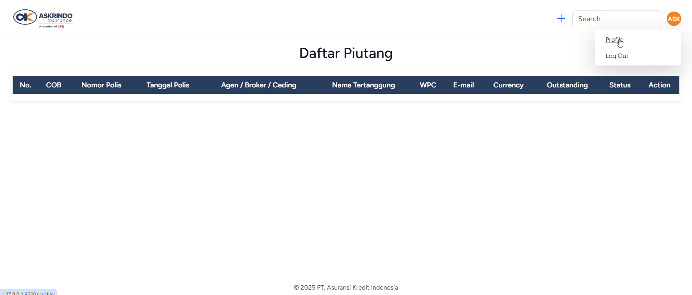
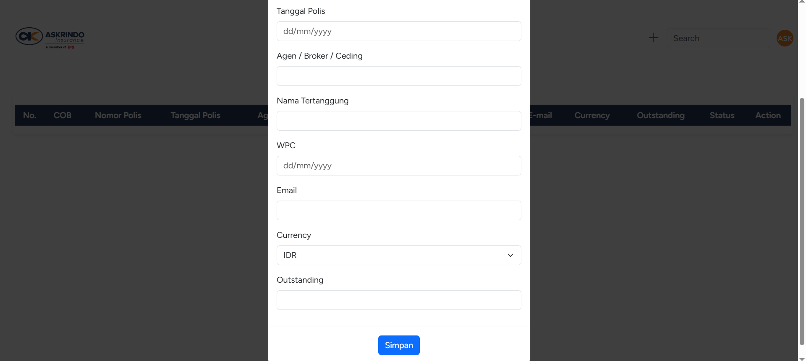
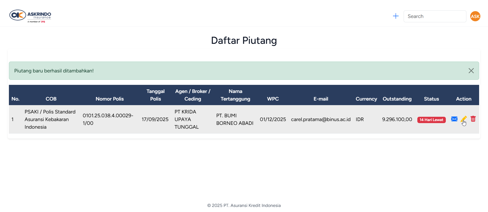
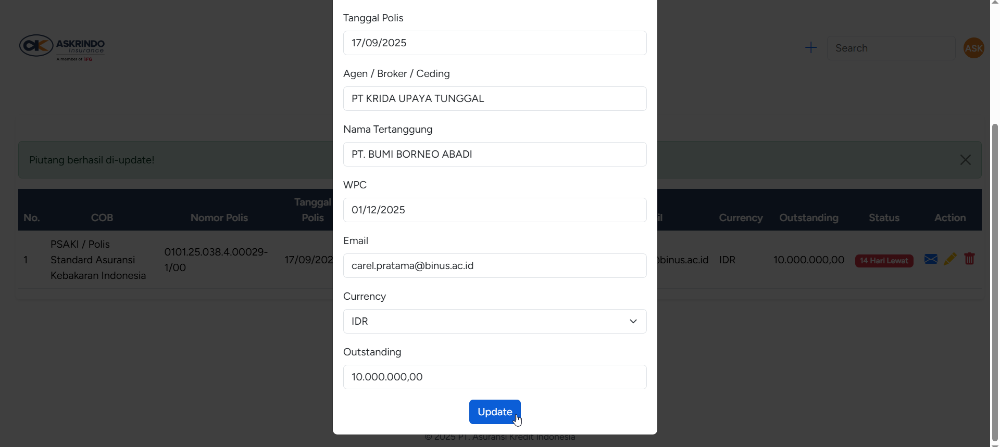
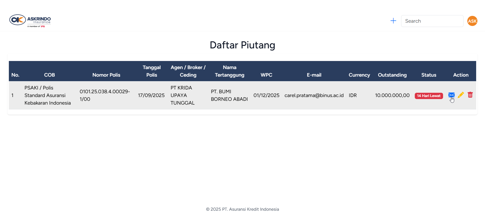
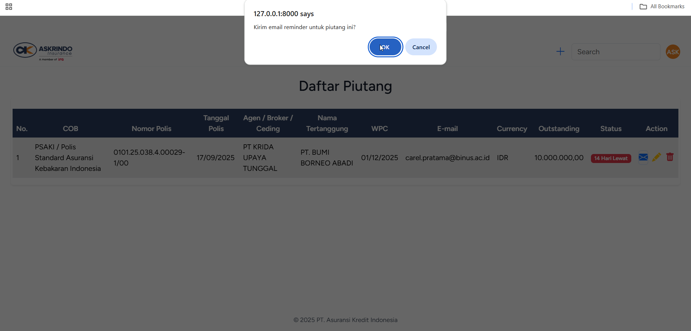
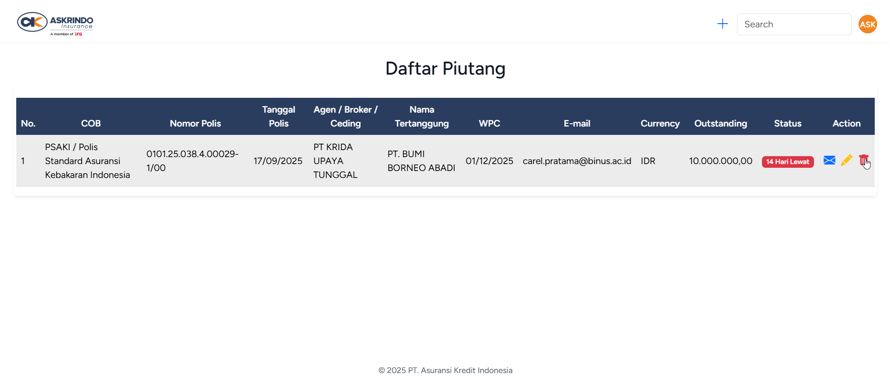
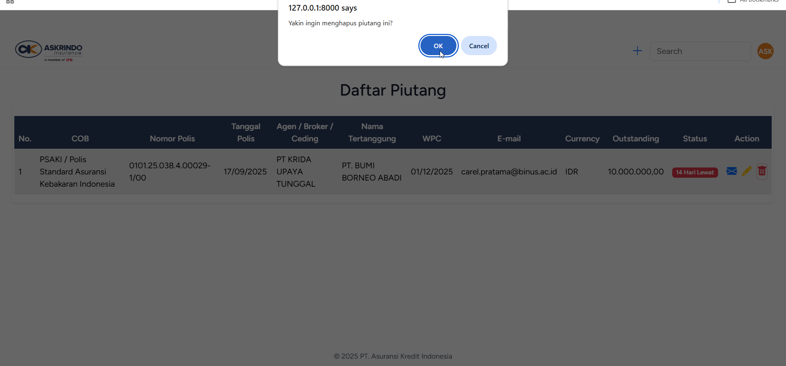

<a href="https://laravel.com" target="_blank">

  

</a>

## Askrindo Piutang Reminder

## Tentang Askrindo Piutang Reminder

Askrindo Piutang Reminder adalah sebuah website agar Askrindo dapat melakukan monitor daftar piutang - piutang yang ada, berapa hari lagi sebelum tanggal jatuh tempo untuk piutang - piutang tersebut, serta mengirim reminder piutang kepada pihak-pihak yang bersangkutan dengan cara yang sangat mudah.

## Cara Menggunakan Askrindo Piutang Reminder

-   Melakukan login

    

-   Melakukan register jika belum pernah register

    

-   Mengganti profile information (jika ingin diubah)

    

-   Tambah daftar piutang

    
    
    

-   Edit piutang (jika ada yang ingin diubah)

    

-   Kirim e-mail reminder

    
    
    
    

-   Delete piutang (jika ada yang ingin dihapus)

    
    
