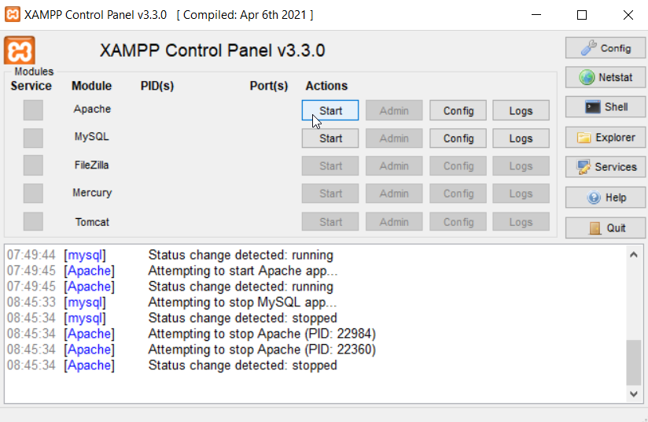
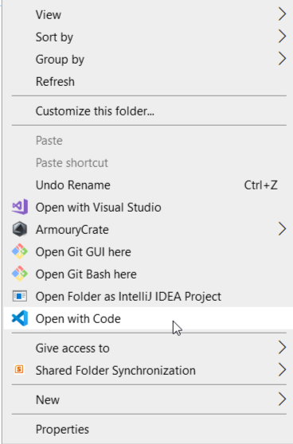
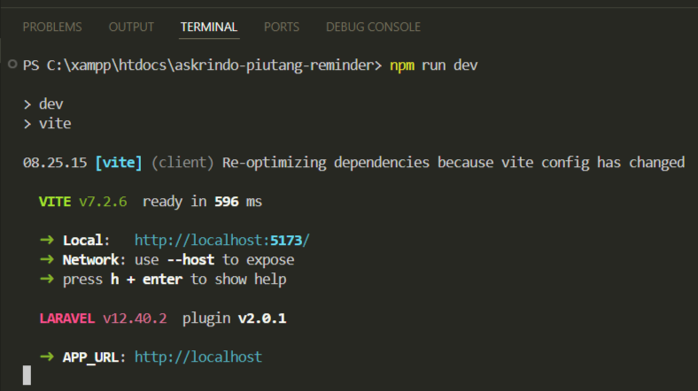
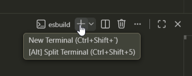
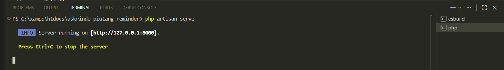
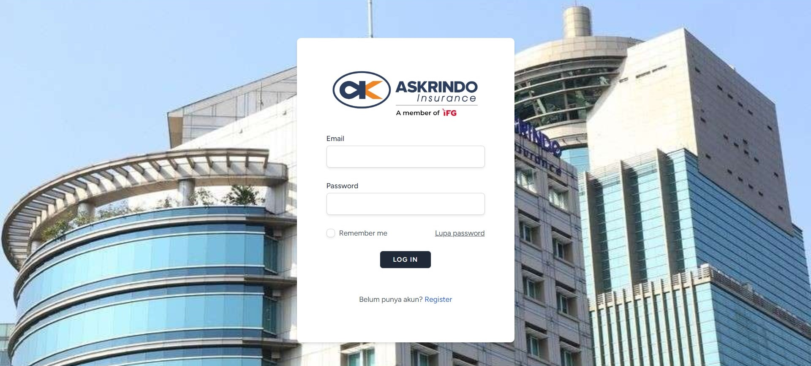
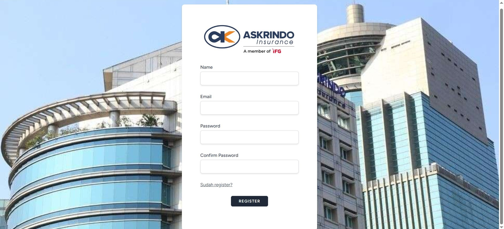
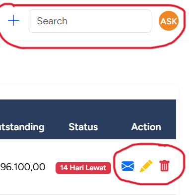
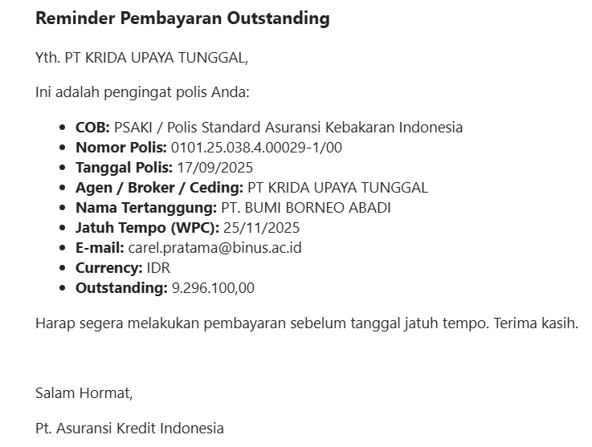

<a href="https://laravel.com" target="_blank">

  

</a>

<h1 align="center">Askrindo Claims Registration</h1>

## Tentang Askrindo Claims Registration

Askrindo Claims Registration adalah sebuah website agar Askrindo dapat melakukan monitor daftar piutang - piutang yang ada, berapa hari lagi sebelum tanggal jatuh tempo untuk piutang - piutang tersebut, serta mengirim reminder piutang kepada pihak-pihak yang bersangkutan dengan cara yang sangat mudah.  

## Cara Run Project Secara Local (untuk developer)

1. Cari aplikasi xampp, lalu click start

 

2. Cari folder askrindo-claims-registration

 

3. Click kanan pada folder, dan click `open with code` atau code editor yang lain (jika menggunakan code editor lain)

 

4. Click tab `terminal` -> `new terminal`

 

5. Ketik `npm run dev`

 

6. Tambah terminal baru

 

7. ketik `php artisan serve` lalu copy paste link yang ada ke browser

 

8. website siap digunakan

 

## Cara Menggunakan Askrindo Piutang Reminder

-   Melakukan login

    

-   Melakukan register jika belum pernah register

    

-   Actions

    

    -   click ➕ untuk menambah daftar piutang

    -   ketik kata di search bar untuk mencari piutang

    -   click profile picture untuk setting profile

    -   click ✉️ untuk mengirim email reminder

    -   click ✏️ untuk edit piutang

    -   click 🗑️ untuk menghapus piutang

-   Cek E-mail setelah click ✉️

    

    sesudah click tombol ✉️, maka email akan otomatis terkirim ke email tujuan beserta detail piutang nya sebagaimana contoh di atas.  

## Author

[Carel Prianugra Ceri Pratama](https://www.linkedin.com/in/carel-prianugra-ceri-pratama/)
